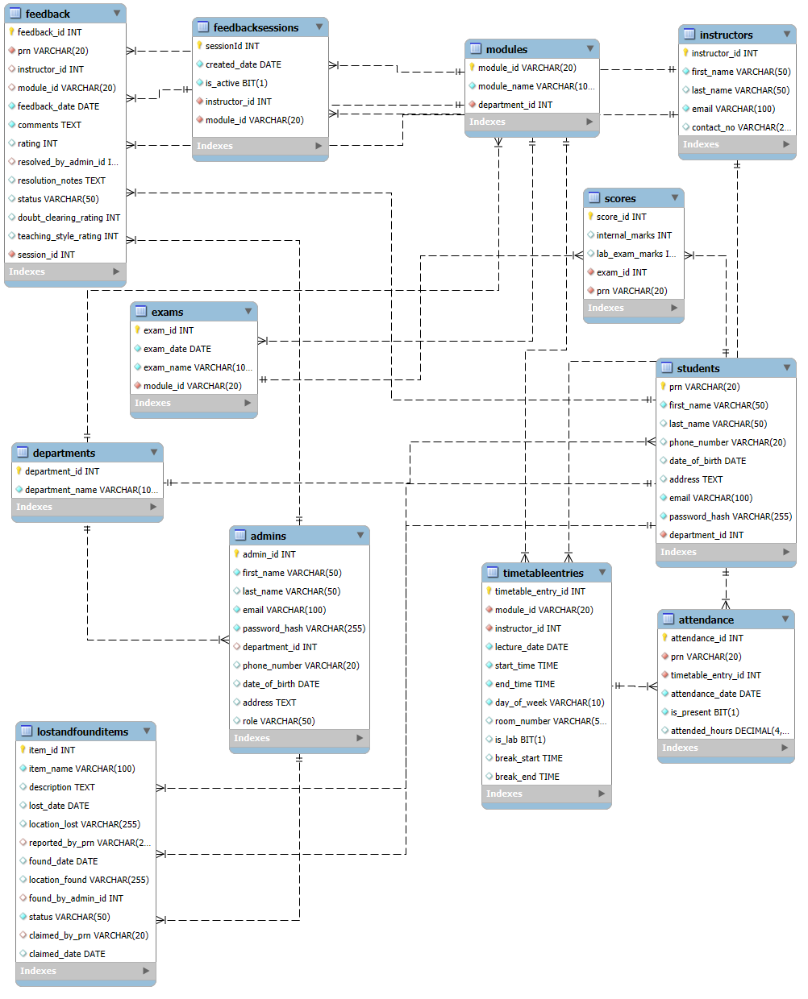

# Student ERP System - Full-Stack Application

This is a comprehensive, full-stack Enterprise Resource Planning (ERP) system designed to manage core academic operations for an educational institution. The application features distinct, role-based interfaces and functionalities for both administrators and students, providing a centralized platform for managing student data, academic schedules, grades, attendance, and feedback.

The backend is built with a secure, stateless RESTful API using Spring Boot, while the frontend is a dynamic and responsive Single Page Application (SPA) built with React.

# Features

## Admin Features

- Dashboard: An "at a glance" view of key system statistics like total students, instructors, and modules.

- User Management: Full CRUD (Create, Read, Update, Delete) functionality for managing Admins, Students, and Instructors.

- Academic Management: Full CRUD for Departments and Course Modules.

- Timetable Management: Create, view, update, and delete class schedules, linking modules and instructors.

- Grades Management: Create exams and record/update student marks (lab and internal) in bulk.

- Attendance Tracking: Mark and update student attendance for specific class sessions in bulk.

- Feedback System: Create feedback sessions and view detailed analytics, including average ratings and anonymous student comments.

- Secure Registration: The ability to register new admins is restricted to users with a "Super Admin" role.

## Student Features

- Dashboard: A personalized dashboard showing key stats like total courses, attendance percentage, and a list of today's classes.

- Profile Management: View and manage personal profile details.

- View Timetable: Access the daily and weekly class schedule.

- View Marks: A consolidated view of all marks obtained in various exams.

- View Attendance: Check personal attendance records.

- Feedback Submission: View active feedback sessions and submit anonymous feedback for instructors and modules.

## Tech Stack

- Backend: Springboot, MySQL

- Frontend: HTML5, CSS3, JavaScript, React

## 🎨 Design

The UI/UX for this project was designed in Figma. You can view the complete design file, including components, wireframes, and prototypes, here:

[**View Figma Design File**](https://www.figma.com/design/OXH5baVMXqzpIT1g49ek9O/CDAC-ERP?node-id=4023-7063&p=f&t=brHIg17ewuVR0Sz6-0)

# ER Diagram

<details>
<summary><strong>Click to see ER Diagram</strong></summary>



</details>

# 🚀 Getting Started

Follow these instructions to get a local copy up and running for development and testing purposes.

## Prerequisites

Backend :

- JDK 17 or newer
- Apache Maven
- MySQL

Frontend:

- NPM

## Getting Started

Make sure you have the following installed:

- Node.js

- npm (comes with Node.js)

## Backend setup

1. Clone the repository:

```bash
git clone https://github.com/prathameshchavan23/Cdac-Project
```

change folder

```bash
cd backend
```

2. Database Configuration:

- Create a new MySQL database (e.g., cdac_project).
- Open src/main/resources/application.properties.
- Update the spring.datasource properties with your MySQL url, username, and password.

3. Application Configuration

- In application.properties, update the jwt.secret with a new, long, and secure secret key.

4. Run the application

```bash
mvn spring-boot:run
```

The backend server will start on http://localhost:8080.

## Frontend Setup

1. Navigate to the frontend directory:

```bash
cd frontend
```

2. Install dependencies:

```bash
npm install
```

3. Run the development server:

```bash
npm run dev
```

The React application will start on http://localhost:5173 (or another port specified by Vite).

## 📋 API Endpoints

A complete list of all available API endpoints is provided below. All administrative endpoints under `/api/admin/**` and student endpoints under `/api/student/**` require a valid JWT Bearer Token for authorization.

<details>
<summary><strong>Click to Expand API Endpoint List</strong></summary>

### Authentication

| HTTP Method | URL Path                   | Description                                       |
| :---------- | :------------------------- | :------------------------------------------------ |
| `POST`      | `/api/auth/register/admin` | (Super Admin Only) Registers a new administrator. |
| `POST`      | `/api/auth/login`          | Logs in a user and returns a JWT.                 |

### Admin Management

| HTTP Method | URL Path                 | Description                        |
| :---------- | :----------------------- | :--------------------------------- |
| `GET`       | `/api/admin/admins`      | Gets a list of all administrators. |
| `GET`       | `/api/admin/admins/{id}` | Gets a single administrator.       |
| `PUT`       | `/api/admin/admins/{id}` | Updates an administrator.          |
| `DELETE`    | `/api/admin/admins/{id}` | Deletes an administrator.          |

### Department Management

| HTTP Method | URL Path                | Description                     |
| :---------- | :---------------------- | :------------------------------ |
| `POST`      | `/api/departments`      | Creates a new department.       |
| `GET`       | `/api/departments`      | Gets a list of all departments. |
| `GET`       | `/api/departments/{id}` | Gets a single department.       |
| `PUT`       | `/api/departments/{id}` | Updates a department.           |
| `DELETE`    | `/api/departments/{id}` | Deletes a department.           |

### Instructor Management

| HTTP Method | URL Path                      | Description                               |
| :---------- | :---------------------------- | :---------------------------------------- |
| `POST`      | `/api/admin/instructors`      | Creates a new instructor.                 |
| `GET`       | `/api/admin/instructors`      | Gets a paginated list of all instructors. |
| `GET`       | `/api/admin/instructors/{id}` | Gets a single instructor.                 |
| `PUT`       | `/api/admin/instructors/{id}` | Updates an instructor.                    |
| `DELETE`    | `/api/admin/instructors/{id}` | Deletes an instructor.                    |

### Student Management (by Admin)

| HTTP Method | URL Path                    | Description                            |
| :---------- | :-------------------------- | :------------------------------------- |
| `POST`      | `/api/admin/students`       | Creates a new student.                 |
| `GET`       | `/api/admin/students`       | Gets a paginated list of all students. |
| `GET`       | `/api/admin/students/{prn}` | Gets a single student.                 |
| `PUT`       | `/api/admin/students/{prn}` | Updates a student.                     |
| `DELETE`    | `/api/admin/students/{prn}` | Deletes a student.                     |

### Module Management

| HTTP Method | URL Path                        | Description                           |
| :---------- | :------------------------------ | :------------------------------------ |
| `POST`      | `/api/admin/modules`            | Creates a new module.                 |
| `GET`       | `/api/admin/modules`            | Gets a paginated list of all modules. |
| `GET`       | `/api/admin/modules/{moduleId}` | Gets a single module.                 |
| `PUT`       | `/api/admin/modules/{moduleId}` | Updates a module.                     |
| `DELETE`    | `/api/admin/modules/{moduleId}` | Deletes a module.                     |

### Timetable Management

| HTTP Method | URL Path               | Description                    |
| :---------- | :--------------------- | :----------------------------- |
| `POST`      | `/api/admin/timetable` | Creates a new timetable entry. |
| `GET`       | `/api/admin/timetable` | Gets all timetable entries.    |

### Grades Management

| HTTP Method | URL Path                                      | Description                                     |
| :---------- | :-------------------------------------------- | :---------------------------------------------- |
| `POST`      | `/api/admin/exams`                            | Creates a new exam.                             |
| `GET`       | `/api/admin/exams`                            | Gets all exams.                                 |
| `POST`      | `/api/admin/scores/bulk`                      | Records or updates marks for multiple students. |
| `GET`       | `/api/admin/scores/exam/{examId}`             | Gets all scores for a specific exam.            |
| `GET`       | `/api/admin/scores/exam/{examId}/marks-sheet` | Gets a paginated marks entry sheet.             |

### Attendance Management

| HTTP Method | URL Path                                     | Description                                        |
| :---------- | :------------------------------------------- | :------------------------------------------------- |
| `POST`      | `/api/admin/attendance`                      | Marks attendance for a single student.             |
| `POST`      | `/api/admin/attendance/bulk`                 | Marks or updates attendance for multiple students. |
| `PUT`       | `/api/admin/attendance/{id}`                 | Updates a single attendance record.                |
| `DELETE`    | `/api/admin/attendance/{id}`                 | Deletes a single attendance record.                |
| `GET`       | `/api/admin/attendance/session/{id}`         | Gets paginated attendance for a class session.     |
| `GET`       | `/api/admin/attendance/session/{id}/by-date` | Gets paginated attendance on a specific date.      |

### Feedback

| HTTP Method | URL Path                                      | Description                                     |
| :---------- | :-------------------------------------------- | :---------------------------------------------- |
| `POST`      | `/api/student/feedback/submit`                | (Student) Submits feedback.                     |
| `GET`       | `/api/student/feedback/sessions/active`       | (Student) Gets active feedback sessions.        |
| `POST`      | `/api/admin/feedback/sessions`                | (Admin) Creates a new feedback session.         |
| `GET`       | `/api/admin/feedback/instructors`             | (Admin) Gets instructors with feedback status.  |
| `GET`       | `/api/admin/feedback/sessions/{id}/stats`     | (Admin) Gets statistics for a feedback session. |
| `GET`       | `/api/admin/feedback/sessions/{id}/anonymous` | (Admin) Gets anonymous feedback for a session.  |
| `DELETE`    | `/api/admin/feedback/{feedbackId}`            | (Admin) Deletes a feedback record.              |

### Student Endpoints

| HTTP Method | URL Path                                | Description                         |
| :---------- | :-------------------------------------- | :---------------------------------- |
| `GET`       | `/api/student/dashboard/stats`          | Gets dashboard statistics.          |
| `GET`       | `/api/student/dashboard/todays-classes` | Gets today's class schedule.        |
| `GET`       | `/api/student/profile`                  | Gets the student's profile details. |
| `GET`       | `/api/student/my-marks`                 | Gets a list of all marks.           |

### Monitoring (Actuator)

| HTTP Method | URL Path           | Description                            |
| :---------- | :----------------- | :------------------------------------- |
| `GET`       | `/actuator/health` | Shows the application's health status. |
| `GET`       | `/actuator/info`   | Shows custom application info.         |

</details>

## Usage

1.  **Run the Backend and Frontend** servers.
2.  The application requires at least one **Super Admin** to function. Use the dummy data SQL script or register the first Super Admin manually.
3.  Log in as the Super Admin to access the administrative dashboard and start managing the system.

## License

This project is licensed under the MIT License - see the LICENSE file for details.
